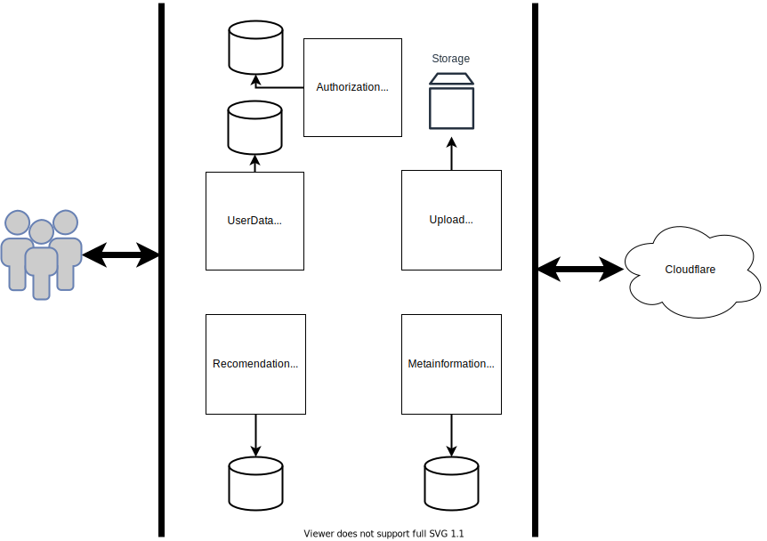

# Webflex
Netflix-like система потокового воспроизведения видео.

## Обзор системы
Для пользователей система предоставляет веб-интферфейс с возможностью просмотра видео. Видеопотоки раздаются через CDN Cloudflare. Возможна разработка рекомендательной системы, различных сценариев взаимодействия с пользователями.

## План разработки
Приблизительно в порядке реализации и приоритета.

+ Сервис загрузки видео в разных форматах в систему.
+ Тестовый сервис раздачи видео для замены CDN на время разработки.
+ Статическая web-страница с плеером.
+ Поддержка различных уровней качества видео.
+ Авторизация, система учета пользователей.
+ Веб-интерфейс для системы.
+ Превью фильмов (трейлеры?), описания, метаинформация.
+ Отзывы.
+ Рекомендательная система.

## Схема

